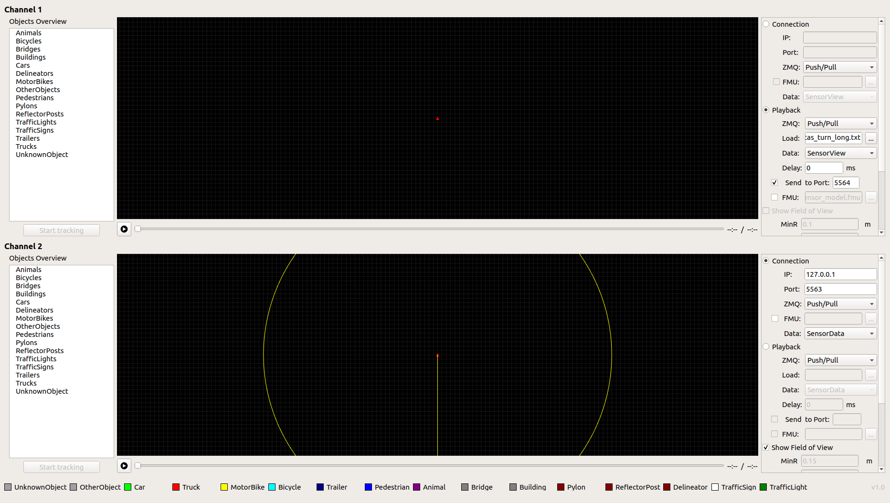
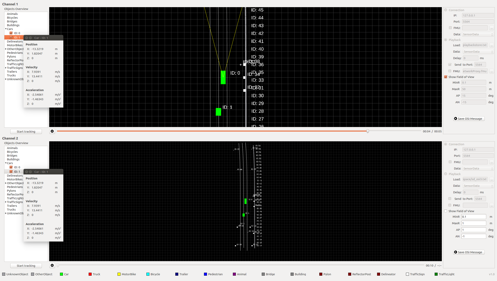

# OSI Visualizer
[](https://travis-ci.org/OpenSimulationInterface/osi-visualizer)

OSI Visualizer serves as visualization tool for the current implementation of [OSI (Open Simulation Interface)](https://github.com/OpenSimulationInterface/open-simulation-interface) messages. It visualizes the `GroundTruth`, `SensorView` and `SensorData` messages. It also supports two independent visual channels with two different input types (file and network stream). For more information see the documentation [here](https://opensimulationinterface.github.io/osi-documentation/osi-visualizer/README.html).

## Usage

In the configuration panel at the right (see Screenshot below) load for channel 1 a scenario as a playback and choose a port to which it will send. In the panel below at channel 2 type in the host and the output port. Select the data type it will output (here `SensorData`). Make sure the appropriate communication server for data exchange is up and running. 



Now you can click on play for channel 1 and 2 and you can visualize the communication between these two channels.  Channel 1 plays an OSI input file and sends out the OSI message to port 5564 at the same time. Channel 2 receives an OSI message from port 5564 and shows up on the canvas (see demo screenshot below).



## Installation

#### Environment and dependencies

Currently we strongly recommend users to use the osi-visualizer under Ubuntu Linux 16.04 LTS. You can see a working development environment based on Ubuntu 16.04 LTS in the Dockerfile in the repository.

* [cmake](https://cmake.org/) (>= 3.5) 
* [Qt](http://download.qt.io/official_releases/qt/) (>= 5.5.0)
* [ZeroMQ](http://zeromq.org/intro:get-the-software) (>= 4.2.1) OSI Visualizer needs to use ZeroMQ libraries to complete the socket communication between different sensor / traffic / scenario simulators. Note that the C++ Bindings are required as well.
* [protobuf](https://github.com/google/protobuf) (>= 2.6.1)
* [FMILibrary](https://svn.jmodelica.org/FMILibrary/tags) (>= 2.0.2)
* [OSI](https://github.com/OpenSimulationInterface/open-simulation-interface.git) (>= 3.1.2) 

#### Build and run

```
cd osi-visualizer
mkdir build
cd build
cmake ..
make
./osi-visualizer
```