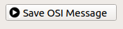

Panels
========

Connection:
-------------

The channel receives osi message from the network with specific IP
address and port number, and shows up different data types.

.. image:: _static/images/Connection.png
    :align: center

Playback:
-------------

The channel receives osi message from the loaded file. The tool will
check a header file of the same name with a extension: .txth. If it doesn't
exist, the tool will create one automatically for the first time. A
"Delta-Delay" variable can be set to slow down the playback speed in
case of very large message files. By default this value is "0" ms.

Example: Set it to 10 ms, each message will have 10 ms more delay for
playing.

Besides the tool provides sending out osi message to network with specific port number.

.. image:: _static/images/PlayBack.png
    :align: center

Show Field of View:
--------------------

Shows the field of view for sensors, like lidar, on the grid. Users can set
minimum range, maximum range, azimuth positive angle and azimuth
negative angle.

.. image:: _static/images/FieldOfView.png
    :align: center

Save OSI Message:
------------------

Log or cut out part of the osi message stream and save it to another
file. By default the threshold is 1000000 OSI messages. The User can change
this threshold in the `appconfig.cpp <https://github.com/OpenSimulationInterface/osi-visualizer/blob/7e8ae13ac01229753b11098c0f530163a59b9a07/src/appconfig.cpp#L53>`_.

Menu options
----------------

File Menu:
~~~~~~~~~~~~

``Play``: Play/Pause Channel 1 by default.

``Python Compare``: A standalone compare tool to compare two osi
message file directly. By default, it takes the playback file from these
two channels. It supports flexible selecting random file as well. Just
put the python scripts into folder: ./Resources/Python/ before start
this tool. Then all the scripts will be shown up in the "Python Scripts"
select menu. The compare script should take the two osi files' full path
as arguments. The compare result can be exported to a text file by
clicking the "Export" button.

``Quit``: Quit the visualizer.

View Menu:
~~~~~~~~~~~~

``Combine Channels``: Config two channels' "Play/Pause"
simultaneously, or not. It can only be checked when the channels are at
the same status: both "Play" or "Pause". By default, it is unchecked.

``Show Grid``: Show up the grid in the canvas. By default, it is
checked.

``Show Object details``: Select object from the Objects Overview tree.
Show up the selected object's position, velocity and acceleration in
another independent dialog. By default, it is checked.

The others are self-explaining.

Notice
------

When playing large osi files, try to adapt the Delta Delay. Then the
tool renders smoothly.

.. _OSI (Open Simulation Interface): https://github.com/OpenSimulationInterface/open-simulation-interface
.. _`https://cmake.org/`: https://cmake.org/
.. _`http://download.qt.io/official_releases/qt/`: http://download.qt.io/official_releases/qt/
.. _`http://zeromq.org/intro:get-the-software`: http://zeromq.org/intro:get-the-software
.. _`https://github.com/google/protobuf`: https://github.com/google/protobuf
.. _`https://svn.jmodelica.org/FMILibrary/tags`: https://svn.jmodelica.org/FMILibrary/tags
.. _Open Simulation Interface: https://github.com/OpenSimulationInterface/open-simulation-interface.git